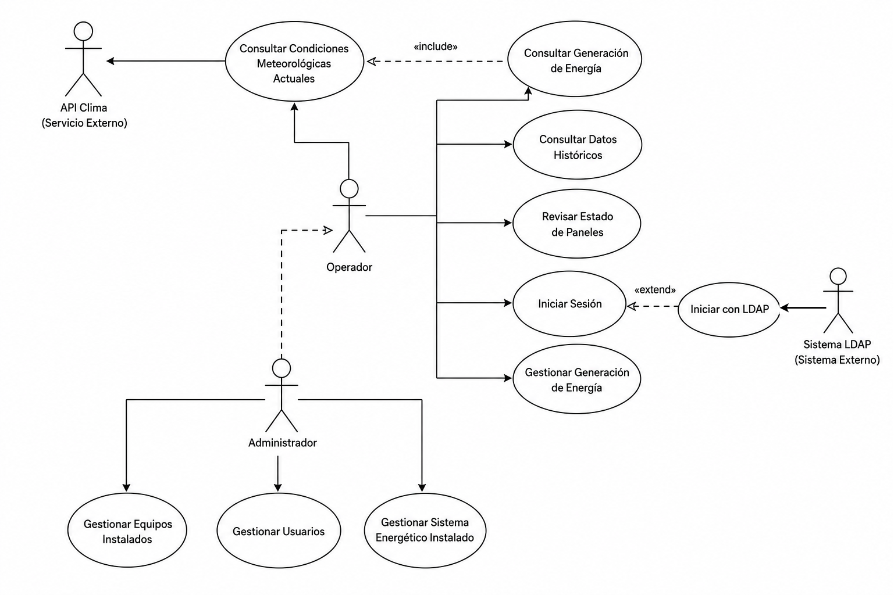
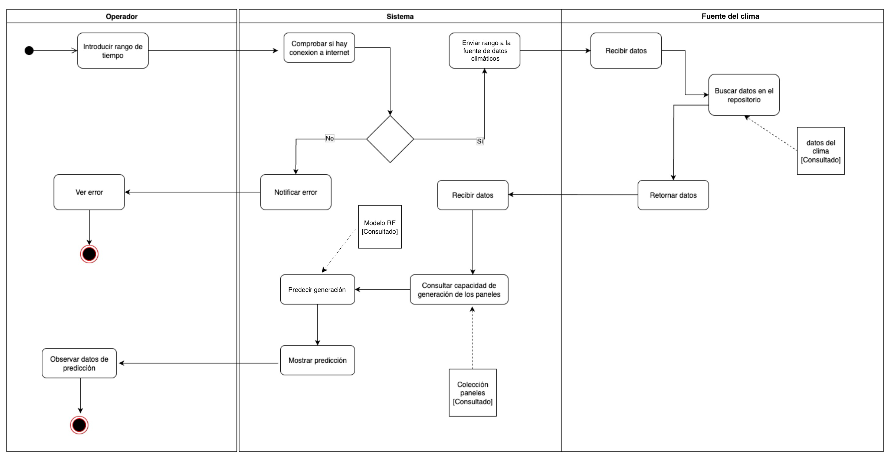

## Descripción del gemelo digital

El sistema propuesto es un gemelo digital web que representa de forma virtual y dinámica una microrred fotovoltaica aislada. No se limita a mostrar el estado actual de la instalación: integra los datos de operación, los modelos de predicción, la simulación del almacenamiento y una interfaz web para asistir al operador en la toma de decisiones [@tao2019dt; @said2026aidt]. Sobre la microrred existente, el gemelo añade tres capacidades que antes no estaban disponibles: anticipar la generación y la demanda de las próximas horas, estimar la autonomía del almacenamiento y diagnosticar el estado de limpieza de los paneles.

Para ello el sistema se organiza en cuatro módulos. El de adquisición y gestión de datos integra y almacena la telemetría de la microrred (generación, consumo, estado de carga y flujos de energía) junto con los datos meteorológicos de un servicio externo. El de analítica reúne los cuatro modelos de inteligencia artificial. El de simulación y servicios de dominio combina datos, pronósticos y configuración para producir las líneas de tiempo de producción y demanda, las estimaciones de autonomía y las alertas. Y el de interfaz web presenta todo ello en un tablero comprensible para operadores, docentes y estudiantes. Separar el sistema en módulos permite que cada uno evolucione por su cuenta y que se incorporen nuevas fuentes o modelos sin rehacer el conjunto [@said2026aidt].

El módulo de analítica integra los cuatro modelos que resume la Tabla \ref{tbl:modelos-ia}, cuyo entrenamiento y evaluación se abordan en el Capítulo 3. La predicción de la generación fotovoltaica usa un bosque aleatorio, denominado *Havana v1*, entrenado con datos históricos de La Habana; predice el factor de capacidad, un valor entre 0 y 1, para que el mismo modelo sirva a cualquier tamaño de instalación, e incorpora variables físicas calculadas con pvlib [@breiman2001randomforests; @pvlib2024docs]. La predicción del consumo se resuelve en el despliegue actual con perfiles horarios configurables, una estrategia de arranque en frío adecuada al volumen de datos disponible, y deja entrenado un bosque aleatorio listo para activarse cuando se acumule histórico propio [@khan2026energyconsumption]. La estimación de autonomía no usa aprendizaje automático: simula hora a hora el balance energético y la física del almacenamiento para calcular cuánto tiempo puede operar la microrred de forma autónoma. Y la clasificación de limpieza emplea una red neuronal convolucional MobileNetV2 con aprendizaje por transferencia [@sandler2018mobilenetv2].

| Modelo | Algoritmo | Variable objetivo | Entrada principal |
|---|---|---|---|
| Generación (*Havana v1*) | Bosque aleatorio | Factor de capacidad (0–1) | 14 características climáticas y físicas |
| Consumo | Perfiles horarios (bosque aleatorio disponible) | Demanda eléctrica (kW) | Perfiles por hora y tipo de día |
| Autonomía | Simulación física | Tiempo hasta el SoC mínimo | Pronósticos de generación y consumo |
| Limpieza | MobileNetV2 (CNN) | Limpio / sucio | Imagen de 224×224 px |

: Modelos de inteligencia artificial del gemelo digital. {#tbl:modelos-ia}

El sistema trabaja con tres familias de datos: variables meteorológicas obtenidas de Open-Meteo (temperatura, humedad, viento, nubosidad e irradiancia), variables eléctricas almacenadas como series temporales (generación, consumo, estado de carga y flujos) y variables temporales de calendario (hora, día y mes, con sus codificaciones cíclicas), que capturan los ritmos de uso del campus [@trull2025folsom; @almarzooqi2024hybrid].

Dos herramientas complementan la captura de datos. La primera permite cargar mediciones reales de consumo por equipo: el administrador sube los ficheros que exportan los analizadores de calidad de potencia, por ejemplo en el formato del Hioki PW3360 (con columnas de fecha, hora y potencia activa), y el sistema los procesa para construir un perfil de 168 posiciones —los siete días de la semana por las veinticuatro horas del día— con el consumo medio de ese equipo en cada franja, que afina la predicción de la demanda. La segunda es un simulador de sombras: a partir de la ubicación de la instalación y de la posición del sol a lo largo del día, calcula un perfil de sombreado por hora solar —la fracción del arreglo que queda en sombra, con la posibilidad de ajustar manualmente la reducción de producción—, medido una vez en un día despejado y reutilizado para corregir las estimaciones de generación.

### Requisitos y casos de uso

A partir de las necesidades anteriores se especifican los requisitos del sistema. Los **requisitos funcionales** (RF) se agrupan por área. Los casos de uso definidos más adelante cubren en conjunto la totalidad de estos requisitos, de modo que un mismo caso de uso puede satisfacer varios RF.

**Gestión de datos y activos**

- RF-01. El sistema debe permitir registrar, consultar, actualizar y eliminar activos de la microrred, incluyendo paneles fotovoltaicos, bancos de baterías, inversores y cargas eléctricas.
- RF-02. El sistema debe almacenar series temporales de generación, consumo y estado de carga, con resolución al menos horaria, preservando la fecha y la hora de cada registro.

**Integración meteorológica y pronósticos**

- RF-03. El sistema debe integrar datos meteorológicos actuales y de pronóstico mediante servicios externos, incorporando al menos temperatura, humedad, nubosidad, velocidad del viento e irradiancia.
- RF-04. El sistema debe exponer un servicio de pronóstico de generación fotovoltaica horaria para un horizonte configurable (por ejemplo, 24 horas), basado en modelos de inteligencia artificial entrenados sobre datos históricos.
- RF-05. El sistema debe exponer un servicio de pronóstico de consumo eléctrico horario para un horizonte configurable.

**Simulación operativa y soporte a la decisión**

- RF-06. El sistema debe estimar la autonomía de las baterías, calculando el tiempo hasta alcanzar umbrales mínimos de estado de carga bajo distintos escenarios de generación y demanda.
- RF-07. El sistema debe generar alertas cuando la autonomía prevista sea inferior a un umbral configurable o cuando se prevean desequilibrios significativos entre generación y consumo.

**Mantenimiento y estado de los paneles**

- RF-08. El sistema debe permitir cargar imágenes de paneles fotovoltaicos y devolver una clasificación del estado de limpieza («limpio» / «sucio») acompañada de una medida de confianza.
- RF-09. El sistema debe mantener un histórico de resultados de clasificación para analizar su impacto en el rendimiento energético.

**Visualización y experiencia de usuario**

- RF-10. El sistema debe proporcionar un tablero web que muestre, en una sola vista, indicadores clave de rendimiento, series temporales de generación y consumo, estado de las baterías y condiciones meteorológicas.
- RF-11. El sistema debe permitir seleccionar intervalos de tiempo para el análisis (día, semana, mes) y filtrar los datos por tipo de variable.
- RF-12. El sistema debe ofrecer vistas específicas para la gestión del inventario de activos y la configuración del sistema (ubicación, fuentes de clima, perfil de consumo y sombreado).

**Seguridad y gestión de usuarios**

- RF-13. El sistema debe proporcionar mecanismos de registro e inicio de sesión de usuarios, con almacenamiento seguro de credenciales y soporte para autenticación contra un directorio corporativo.
- RF-14. El sistema debe distinguir al menos entre un rol administrador (gestión de activos y configuración) y un rol operador (visualización y consulta).

Los **requisitos no funcionales** (RNF) se definen según el modelo de calidad ISO/IEC 25010 [@iso25010]:

- RNF-01. *(Desempeño)* El tiempo de respuesta de las operaciones de lectura de datos y de la visualización principal no debe superar los 2 segundos bajo condiciones de carga nominal.
- RNF-02. *(Desempeño)* El sistema debe gestionar la visualización y el análisis de al menos un año de datos horarios sin deterioro apreciable del rendimiento.
- RNF-03. *(Fiabilidad)* El sistema debe tolerar fallos temporales en las API meteorológicas manteniendo un nivel mínimo de servicio mediante datos de respaldo.
- RNF-04. *(Fiabilidad)* La arquitectura debe facilitar niveles de disponibilidad adecuados para un entorno académico y de laboratorio.
- RNF-05. *(Usabilidad)* La interfaz debe ser utilizable por usuarios sin formación avanzada en sistemas eléctricos, presentando los conceptos clave con terminología clara.
- RNF-06. *(Usabilidad)* Las visualizaciones deben ser legibles en pantallas de tamaño medio (proyectores o monitores de aula), evitando la sobrecarga de información.
- RNF-07. *(Seguridad)* Las credenciales de usuario deben almacenarse empleando algoritmos de derivación de clave robustos, evitando el almacenamiento de contraseñas en texto plano.
- RNF-08. *(Seguridad)* El sistema debe controlar el acceso a las operaciones sensibles en función del rol del usuario autenticado.
- RNF-09. *(Mantenibilidad)* La organización en módulos debe permitir sustituir o actualizar los modelos de inteligencia artificial sin alterar de forma significativa la interfaz de usuario.
- RNF-10. *(Mantenibilidad)* El sistema debe documentar sus servicios y modelos principales, incluyendo variables de entrada y salida, métricas de desempeño y supuestos de diseño.
- RNF-11. *(Portabilidad)* El backend debe poder desplegarse en entornos de laboratorio y en servidores de la universidad con cambios mínimos de configuración.
- RNF-12. *(Portabilidad)* El frontend web debe ser accesible desde navegadores modernos sin requerir complementos propietarios.

Estos requisitos se traducen en un conjunto de atributos de calidad que guían el diseño arquitectónico, sintetizados en la Tabla \ref{tbl:atributos-calidad}.

| Atributo | Descripción en el contexto del sistema |
|---|---|
| Funcionalidad | Cubre el monitoreo, la predicción, el análisis y el mantenimiento. |
| Rendimiento | Tiempos de respuesta adecuados para una operación de monitoreo. |
| Fiabilidad | Comportamiento estable y tolerancia a fallos de servicios externos. |
| Usabilidad | Información clara y coherente para usuarios técnicos. |
| Seguridad | Acceso protegido por autenticación y control de permisos por rol. |
| Mantenibilidad | Estructura modular que facilita correcciones y mejoras. |
| Escalabilidad | Ampliable (más sensores, modelos o usuarios) sin rediseñar el núcleo. |
| Portabilidad | Desplegable en la infraestructura de la universidad con herramientas libres. |

: Atributos de calidad objetivo del sistema. {#tbl:atributos-calidad}

El diseño está sujeto, además, a varias **restricciones**: emplear únicamente tecnologías libres y de código abierto; desplegarse en hardware de laboratorio de la CUJAE; mantener toda la configuración del emplazamiento en datos, de modo que el sistema sirva a otra microrred sin tocar el código; y operar como herramienta de monitoreo, predicción y apoyo a la decisión, sin integración con sensores físicos en tiempo real ni control en lazo cerrado, que quedan fuera del alcance.

El comportamiento observable se modela con casos de uso. El actor principal es el Operador, que supervisa la microrred y consulta el clima, la generación y sus predicciones, los históricos y el estado de los paneles. El Administrador hereda esas capacidades y añade la gestión de equipos, de usuarios y de la configuración del sistema. Dos actores externos completan el modelo: la API de clima (Open-Meteo), que provee los datos meteorológicos, y el directorio LDAP, contra el que puede validarse la autenticación [@openmeteo2024]. La Figura \ref{fig:cus} presenta el diagrama de casos de uso.

{#fig:cus width=90%}

Para no extender el capítulo no se describen los nueve casos de uso, sino solo los tres principales, los que materializan las capacidades distintivas del gemelo digital: la predicción de la generación, el diagnóstico del estado de los paneles y la simulación de la autonomía. Los demás siguen la misma plantilla.

| Campo | Descripción |
|:---|:---|
| **Caso de uso** | Consultar generación de energía |
| **Actores** | Operador |
| **Descripción** | El operador solicita la generación de la microrred para el instante actual y para un periodo reciente. El sistema muestra la potencia instantánea, la energía diaria acumulada y los pronósticos de generación, junto con la demanda prevista, que producen los modelos de inteligencia artificial a partir de los datos meteorológicos. |
| **Requisitos funcionales** | RF-02, RF-04, RF-05, RF-10, RF-11 |
| **Casos de uso asociados** | Consultar condiciones meteorológicas actuales («include»), Iniciar sesión |
| **Precondiciones** | El usuario está autenticado y existen la configuración de paneles y los datos meteorológicos necesarios para el pronóstico. |
| **Postcondiciones** | Se visualizan la generación actual, el histórico reciente y los pronósticos de producción y demanda para el horizonte solicitado. |

: Caso de uso CU-03 — Consultar generación de energía. {#tbl:cu03}

| Campo | Descripción |
|:---|:---|
| **Caso de uso** | Revisar estado de paneles |
| **Actores** | Operador |
| **Descripción** | El operador sube una imagen de un arreglo fotovoltaico. El sistema ejecuta el modelo de clasificación para determinar si el panel está limpio o sucio, devuelve la etiqueta con su medida de confianza y registra el resultado para su posterior análisis. |
| **Requisitos funcionales** | RF-08, RF-09 |
| **Casos de uso asociados** | Iniciar sesión |
| **Precondiciones** | El usuario está autenticado y el modelo de clasificación de imágenes está disponible. |
| **Postcondiciones** | Se obtiene la clasificación del estado de limpieza del panel y se registra para el análisis histórico y las decisiones de mantenimiento. |

: Caso de uso CU-05 — Revisar estado de paneles. {#tbl:cu05}

| Campo | Descripción |
|:---|:---|
| **Caso de uso** | Gestionar generación de energía |
| **Actores** | Operador |
| **Descripción** | El operador administra los datos de generación: registra y ajusta las lecturas de producción y configura el horizonte y los parámetros del pronóstico. Sobre esa información, el sistema estima la autonomía del almacenamiento bajo las condiciones previstas y emite alertas cuando la autonomía o el balance energético se acercan a los umbrales críticos. |
| **Requisitos funcionales** | RF-02, RF-06, RF-07 |
| **Casos de uso asociados** | Iniciar sesión |
| **Precondiciones** | El usuario está autenticado y existen la configuración de baterías y los datos de generación y consumo. |
| **Postcondiciones** | Se actualizan los datos y los parámetros de generación, y el sistema dispone de la estimación de autonomía y de las alertas asociadas. |

: Caso de uso CU-06 — Gestionar generación de energía. {#tbl:cu06}

Para ilustrar cómo funciona el sistema por dentro, la Figura \ref{fig:actividades} muestra el diagrama de actividades del caso «Consultar generación de energía», que coordina al operador, al sistema y a la fuente de clima. El operador indica el rango de tiempo; el sistema comprueba la conexión y, si la hay, obtiene los datos meteorológicos, consulta la capacidad instalada en la colección de paneles, ejecuta el modelo de bosque aleatorio para predecir la generación y muestra el resultado. Este flujo resume el patrón que siguen, con variantes, el resto de las consultas del gemelo.

{#fig:actividades width=100%}
