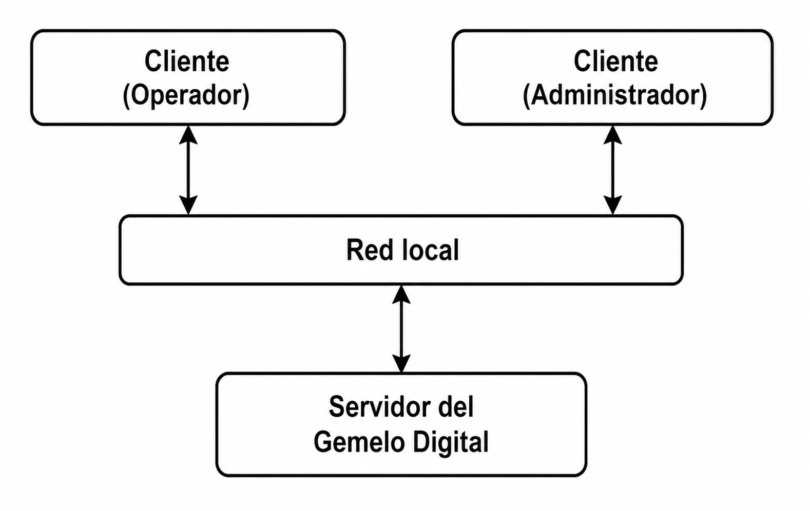
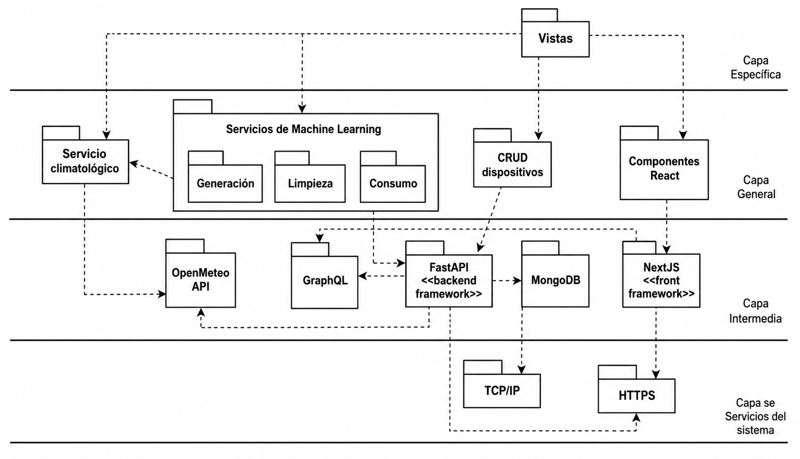
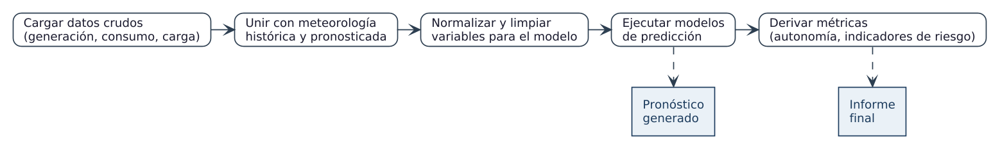
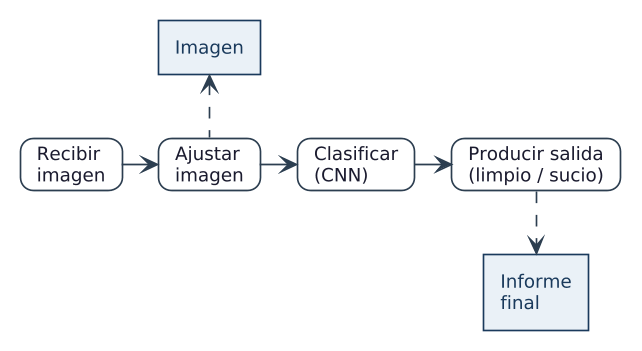
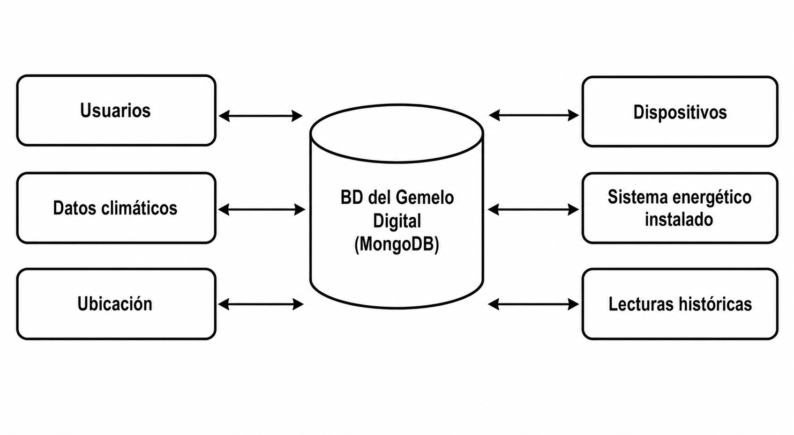
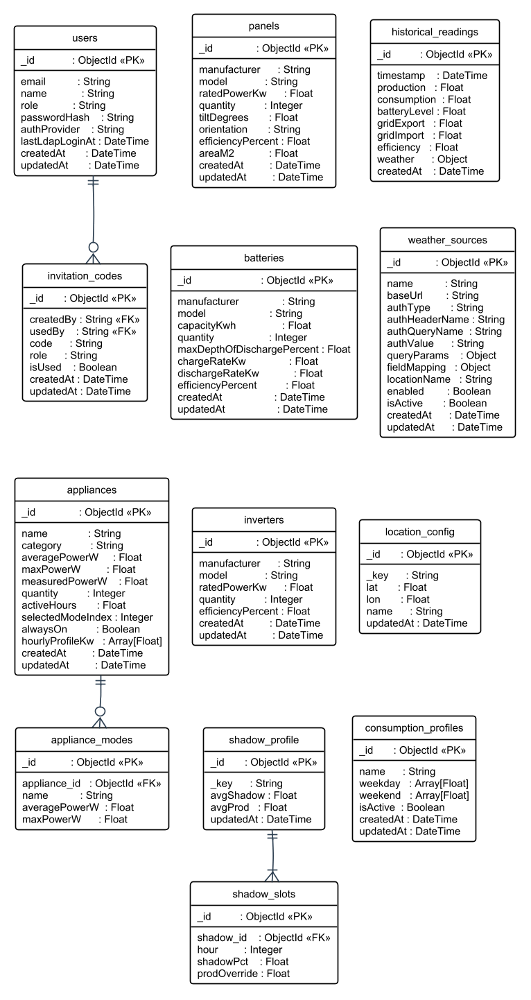

## Arquitectura de la solución

La arquitectura se eligió con cuatro criterios: una complejidad operativa abordable por un equipo de pregrado, la evolución modular, la escalabilidad progresiva y la posibilidad de razonar de forma explícita sobre los atributos de calidad. Con ellos se adopta un monolito modular cliente–servidor: un cliente web en Next.js sobre React y un servidor en Python (FastAPI) que concentra la lógica de negocio, el acceso a datos y la analítica. Ambos se comunican exclusivamente mediante una API GraphQL, y el cliente no accede en ningún caso directamente a la base de datos. Esta opción, más simple que una de microservicios, se ajusta al alcance del proyecto y mantiene la complejidad manejable sin renunciar a la extensibilidad [@fastapi2024docs; @tao2019dt]. La Tabla \ref{tbl:stack} resume el stack concreto y sus versiones.

| Capa | Tecnología | Rol |
|---|---|---|
| Presentación | Next.js 15 / React 19 / TypeScript / Tailwind / Recharts | Tablero y visualización |
| Comunicación | GraphQL (Strawberry + urql) + un endpoint REST | Contrato cliente–servidor |
| Backend | FastAPI (Python) | Servicios de dominio y analítica |
| Aprendizaje automático | scikit-learn, TensorFlow, pvlib | Predicción y clasificación |
| Persistencia | MongoDB | Base de datos documental |
| Clima | Open-Meteo | Fuente de datos meteorológicos |
| Autenticación | PyJWT (HS256) + LDAP | Tokens, invitaciones y directorio |

: Stack tecnológico del gemelo digital. {#tbl:stack}

La arquitectura se describe a continuación mediante cuatro vistas, cada una apoyada en su diagrama, según la práctica de descripción arquitectónica por vistas [@ieee42010].

### Patrón cliente–servidor

El sistema separa con claridad dos aplicaciones (Figura \ref{fig:cliente-servidor}): el servidor, que aloja la lógica de negocio, los servicios de dominio y el acceso a datos, y el cliente web, que ejecutan el operador y el administrador para mostrar tableros, formularios y gráficos. El cliente se comunica con el servidor mediante peticiones GraphQL sobre HTTP, con el token de autenticación en cada solicitud; la única excepción es un endpoint REST para la carga de imágenes de paneles, donde el formato multiparte resulta más natural. Concentrar la lógica en el servidor y dejar la experiencia de usuario en el cliente beneficia la modificabilidad y la portabilidad: la interfaz puede evolucionar sin tocar el núcleo, e incluso podrían construirse otros clientes sobre la misma API.

{#fig:cliente-servidor width=70%}

### Arquitectura en n-capas y reutilización

Dentro del servidor, el sistema se estructura en capas horizontales con responsabilidades delimitadas (Figura \ref{fig:ncapas}): una capa de vistas que ve el usuario; una capa general con los componentes de interfaz, el servicio de clima, la gestión de dispositivos y los servicios de aprendizaje automático; una capa intermedia con los frameworks de soporte (Next.js, la API GraphQL, FastAPI, MongoDB y Open-Meteo); y una capa de servicios del sistema con los protocolos de transporte. La separación en capas es la base de la **reutilización** del sistema: cada capa evoluciona de forma independiente mientras respete sus interfaces, los componentes de visualización (gráficos de series, tarjetas de indicadores, tablas) se reutilizan entre vistas, y el propio monolito modular es replicable en futuros proyectos de microrredes de la CUJAE.

{#fig:ncapas width=80%}

### Flujo de datos: tuberías y filtros

La preparación y el análisis de datos para la inteligencia artificial se organizan como una secuencia de transformaciones, donde cada etapa recibe datos, los procesa y entrega su salida a la siguiente. El flujo de predicción (Figura \ref{fig:flujo-gen}) carga los datos de generación y consumo, los une con la meteorología, limpia y normaliza las variables, ejecuta los modelos y deriva las métricas operativas. El flujo de clasificación (Figura \ref{fig:flujo-limpieza}) recibe la imagen del panel, la ajusta al formato del modelo, la clasifica y devuelve la etiqueta. Tratar cada etapa como un filtro permite sustituir una sin alterar las demás y localizar los errores con facilidad.

{#fig:flujo-gen width=90%}

{#fig:flujo-limpieza width=85%}

### Patrón repositorio y diseño de la base de datos

El acceso a los datos se organiza en torno a un almacén central mediante el patrón repositorio sobre MongoDB (Figura \ref{fig:repositorio}), que mantiene el inventario, la telemetría, la configuración y los usuarios. Centralizar el acceso reduce la duplicidad, permite validaciones coherentes y deja cambiar la persistencia sin afectar a la lógica de negocio, siempre que se conserve su interfaz [@mongodb2024docs].

{#fig:repositorio width=70%}

La base de datos, **GemeloDigital**, concentra toda la información en catorce colecciones organizadas en cuatro dominios (Figura \ref{fig:bd}). El dominio físico describe los activos: `paneles`, `baterias`, `inversores`, `electrodomesticos` (con sus modos de operación y perfil de consumo) y `shadow_profile` (el perfil de sombreado por hora). El dominio de telemetría y mediciones lo forman `lecturas_historicas` —la colección de mayor volumen, con la marca de tiempo, la potencia generada y consumida, el estado de carga, los flujos y la eficiencia, que sirve tanto para los históricos como para entrenar y validar los modelos— junto con `mediciones_equipos` y `mediciones_lotes`, que guardan las mediciones de consumo cargadas por equipo individual. El dominio de configuración y clima reúne `ubicacion_config`, `weather_sources` y `consumption_profiles`. Y el dominio de usuarios y acceso lo componen `usuarios`, `invitation_codes` —que implementa el registro controlado por códigos asociados a un rol— y `sessions`, que mantiene las sesiones de usuario. El modelo documental absorbe la evolución del esquema sin migraciones costosas, lo que encaja con el carácter heterogéneo y cambiante de los datos de la microrred [@mongodb2024docs; @carvalho2023nosql].

{#fig:bd width=62%}

### API y capa de servicios

El sistema expone su funcionalidad a través de una única API GraphQL, servida por el backend en el endpoint `/graphql`, complementada por un endpoint REST para la carga de imágenes. El cliente no contiene rutas de servidor ni accede a la base de datos: obtiene y modifica todos los datos mediante consultas (*queries*) y mutaciones (*mutations*) GraphQL, lo que elimina el encadenamiento de llamadas propio de una integración basada en múltiples endpoints REST. La Tabla \ref{tbl:api} resume las operaciones principales.

| Tipo | Operaciones principales |
|---|---|
| Estado y predicción | `solar` (estado instantáneo de generación, consumo, baterías, flujos y clima), `weather`, `predictions` (curva horaria y alertas), `mlPredict*`, `mlPredictConsumption*`, `batteryDischargeEstimate` |
| Histórico e inventario | `historicalReadings`, `dailySummaries`, `panels`, `batteries`, `inverters`, `appliances`, `weatherSources`, `locationConfig`, `shadowProfile`, `consumptionProfile` |
| Activos y configuración | altas, bajas y cambios de paneles, baterías, inversores y cargas; `uploadApplianceMeasurement`, `saveShadowProfile`, `saveLocationConfig`, `saveConsumptionProfile` y las mutaciones de fuentes de clima |
| Cuentas | `registerUser`, `loginUser`, `loginLdap`, `changePassword`, `generateInvitationCode` |

: Operaciones principales de la API GraphQL. {#tbl:api}

El único servicio fuera de GraphQL es `POST /api/classify-panel`, que recibe la imagen de un panel, ejecuta la inferencia del clasificador y devuelve la etiqueta de limpieza con su probabilidad; se mantiene como REST porque la transferencia de ficheros binarios resulta más natural en ese estilo. Toda operación que modifique datos o acceda a información sensible requiere un token JWT firmado con HS256, del que el backend extrae el rol del usuario para aplicar el control de acceso; las escrituras sobre el inventario y la configuración quedan reservadas al rol administrador. El registro de cuentas se controla mediante códigos de invitación, y el sistema admite además validar las credenciales contra un directorio LDAP corporativo.
