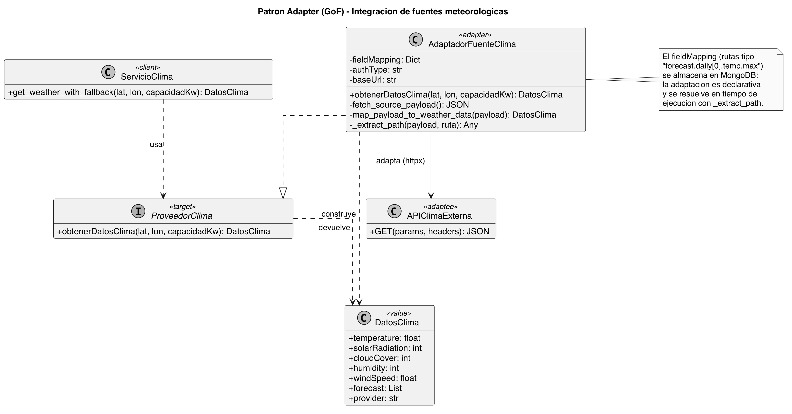
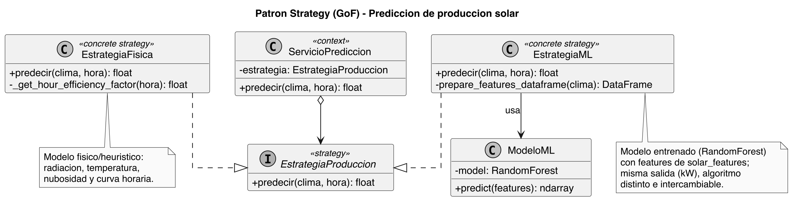
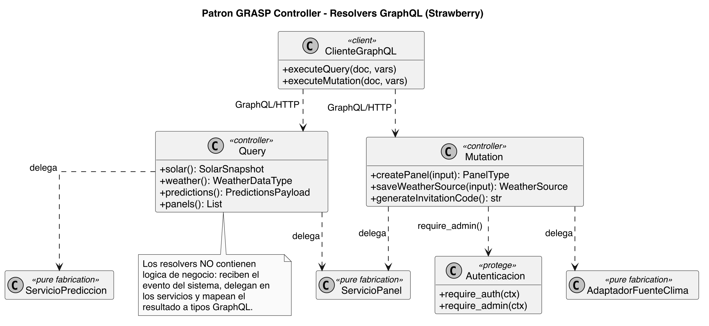
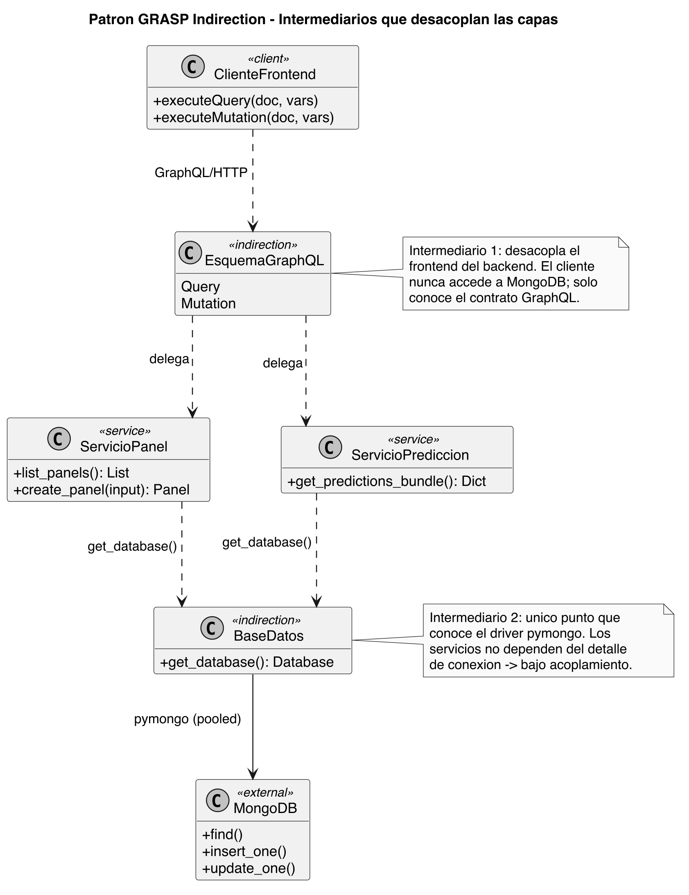
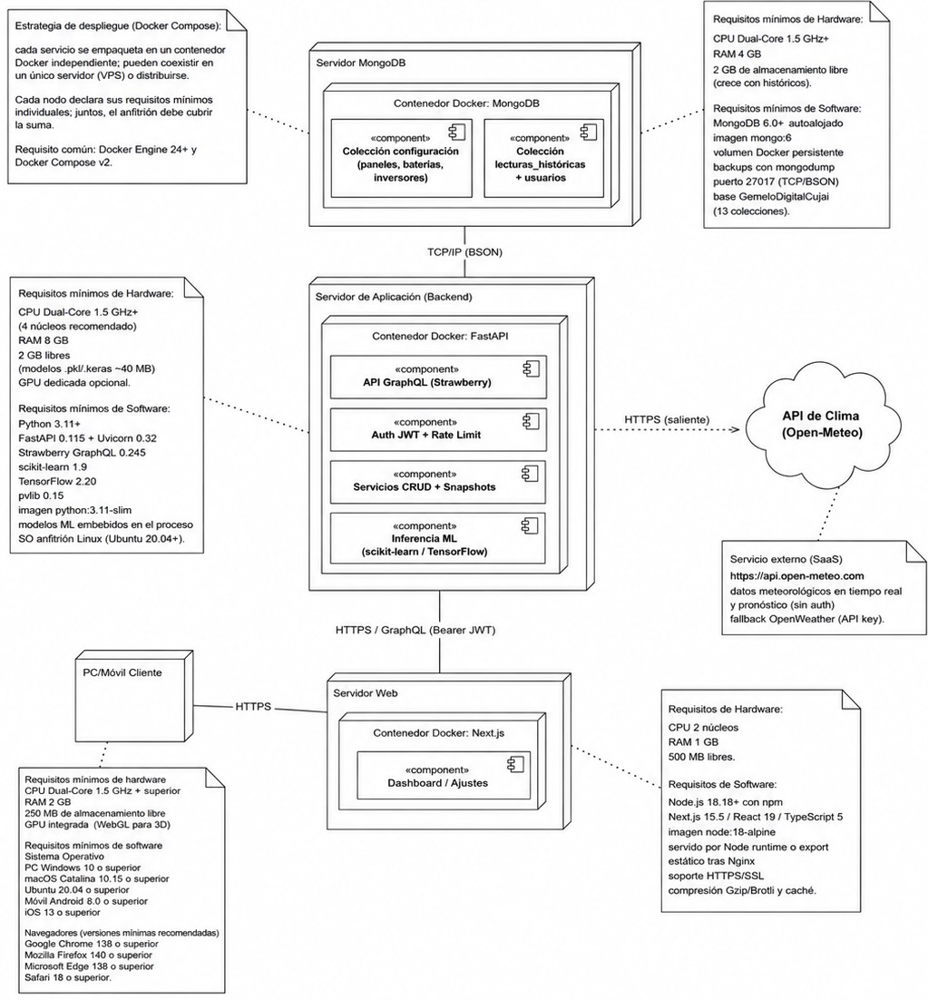

## Principios y patrones de diseño

El código se guía por principios que buscan un sistema fácil de modificar y reutilizar: alta cohesión, bajo acoplamiento, modularidad y separación entre interfaz e implementación, junto con las reglas pragmáticas DRY (no repetir) y KISS (mantenerlo simple). La cohesión se logra agrupando responsabilidades afines en servicios de dominio (telemetría, predicción, inventario, clima, configuración y autenticación); el acoplamiento se limita con contratos claros entre capas. Sobre esa base se adoptan los principios SOLID [@martin2017clean], que en la práctica se traducen, por ejemplo, en que la orquestación de las predicciones trabaja contra una abstracción de «modelo», lo que permite añadir nuevas estrategias sin tocar los controladores ni la interfaz. La implementación incorpora, además, cuatro patrones concretos de los catálogos GoF [@gamma1994patterns] y GRASP [@larman2004applying].

### Adapter (GoF)

El servicio de fuentes de clima integra proveedores meteorológicos con formatos de respuesta distintos (Figura \ref{fig:adapter}). Un adaptador traduce la respuesta cruda de cada API al objeto canónico que espera el resto del sistema; la correspondencia entre campos es declarativa y se guarda en la base de datos, de modo que añadir una nueva fuente no exige tocar el código, solo registrar su mapeo.

{#fig:adapter width=95%}

### Strategy (GoF)

La predicción de producción admite algoritmos intercambiables tras una misma interfaz (Figura \ref{fig:strategy}): una estrategia física, basada en radiación, temperatura y nubosidad, y una estrategia de aprendizaje automático, el bosque aleatorio. El servicio opera sobre la abstracción, lo que permite comparar ambos enfoques y validar el modelo frente a la referencia física sin afectar al resto del sistema.

{#fig:strategy width=95%}

### Controller (GRASP)

Los *resolvers* de GraphQL son el punto de entrada de las peticiones (Figura \ref{fig:controller}): no contienen lógica de negocio, sino que la delegan en la capa de servicios y coordinan el control de acceso. Así se separa la interfaz de comunicación de las reglas del dominio y se mantiene cohesionada la capa de servicios.

{#fig:controller width=95%}

### Indirección (GRASP)

Dos intermediarios evitan los acoplamientos directos (Figura \ref{fig:indireccion}): el esquema GraphQL media entre el frontend y el backend, de modo que el cliente nunca conoce la base de datos, y un único punto de acceso encapsula el controlador de MongoDB. Ambos permiten cambiar el almacenamiento o la tecnología de comunicación con un impacto mínimo sobre el resto.

{#fig:indireccion width=55%}

## Despliegue e integración con servicios externos

El sistema se empaqueta con Docker Compose, con cada servicio en su propio contenedor, lo que permite ejecutarlo en un único servidor de laboratorio o repartirlo en máquinas distintas con cambios mínimos de configuración. El diagrama de despliegue (Figura \ref{fig:despliegue}) organiza el sistema en tres nodos: el servidor web (contenedor Next.js), que sirve el tablero; el servidor de aplicación (contenedor FastAPI), que aloja la API GraphQL, la autenticación, los servicios CRUD y la inferencia de los modelos; y el servidor de base de datos (contenedor MongoDB). El cliente se comunica con el servidor web y con la API por HTTPS; el backend accede a MongoDB por TCP/IP y consulta la API externa por HTTPS.

{#fig:despliegue width=100%}

El gemelo se apoya en dos integraciones con terceros. La primera es la API meteorológica Open-Meteo: ante una consulta de generación, el backend le solicita el pronóstico horario para las coordenadas configuradas, calcula con pvlib las variables físicas derivadas, ejecuta el modelo y devuelve la predicción; si el servicio no responde, un mecanismo de respaldo basado en datos sintéticos mantiene la operación [@openmeteo2024]. La segunda es el directorio LDAP corporativo: en el primer acceso la cuenta se aprovisiona con un código de invitación y los accesos posteriores se validan contra el directorio, emitiendo siempre el mismo tipo de token JWT. Las pantallas del sistema no se muestran en este capítulo; se presentan en el Capítulo 3 como parte de las pruebas funcionales.

<!-- TODO (figuras, etapa 2): añadir un diagrama de secuencia de la integración con Open-Meteo (operador → backend → Open-Meteo → pvlib → modelo → respuesta) y, opcionalmente, otro de la autenticación LDAP. -->
