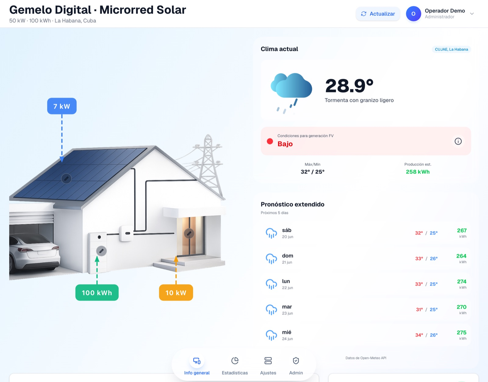
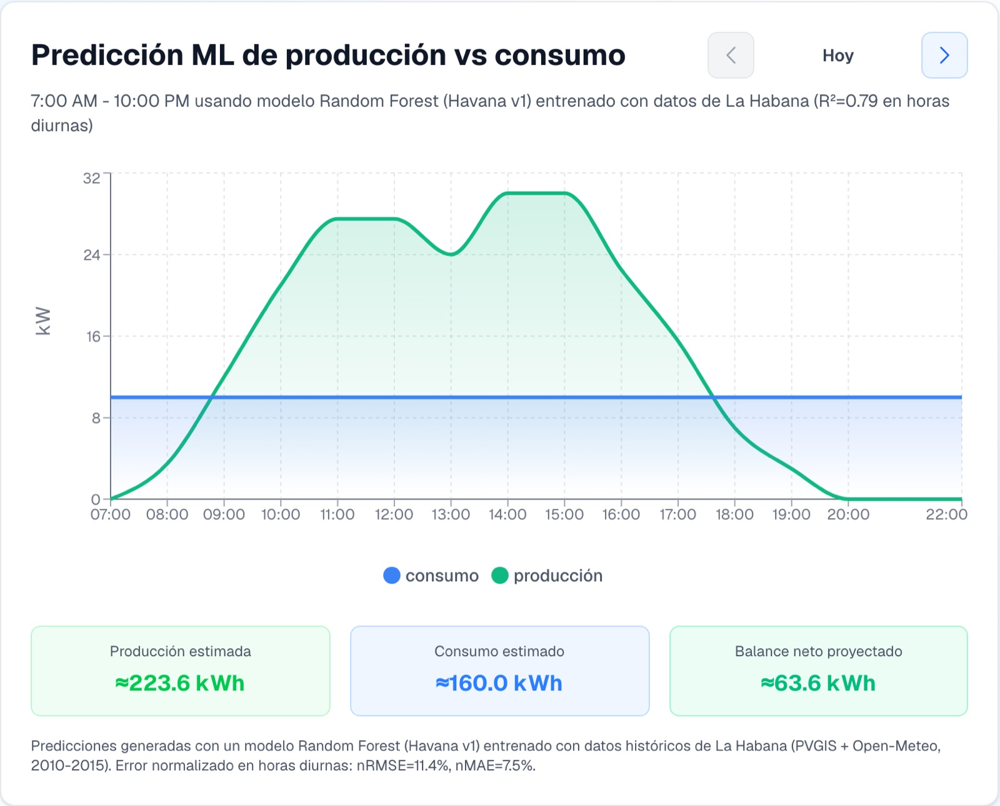
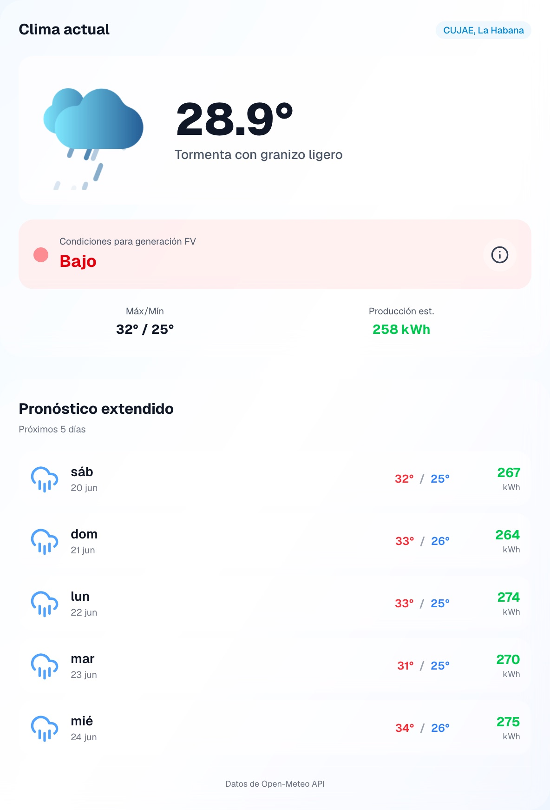
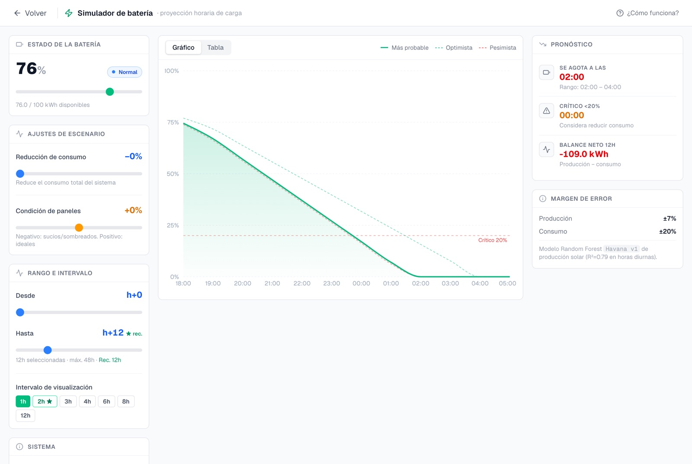
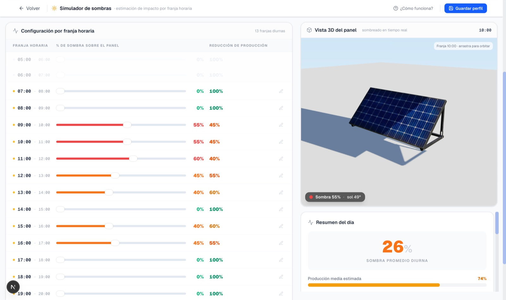

## Operación del sistema en el escenario de la CUJAE

Más allá de las pruebas, el sistema se ejecutó configurado para la microrred de la CUJAE, con datos meteorológicos en vivo de Open-Meteo y los parámetros del sitio, para mostrar su funcionamiento. Como el alcance excluye la integración con sensores físicos, la generación, el estado de carga y los flujos que presenta el sistema son la estimación de los modelos a partir del clima y de la ficha técnica de los equipos, no una telemetría medida en la instalación. El tablero principal (Figura \ref{fig:dash-gen}) reúne, sobre un esquema de la microrred, la potencia generada, el estado de carga de las baterías y los flujos de energía del momento, junto con las condiciones meteorológicas y el pronóstico a varios días.

{#fig:dash-gen width=95%}

El gráfico de producción frente a consumo (Figura \ref{fig:graf-gc}) superpone la generación prevista por el Random Forest y la demanda estimada, con la energía diaria y el balance neto, lo que permite anticipar desajustes y picos antes de que ocurran. El panel meteorológico (Figura \ref{fig:clima}) integra las condiciones actuales y el pronóstico de Open-Meteo con la producción estimada para cada día.

{#fig:graf-gc width=80%}

{#fig:clima width=70%}

A partir de estas predicciones, el gemelo emite alertas por severidad: críticas cuando el nivel de batería previsto baja del 20 %, de advertencia bajo el 40 % o ante un déficit superior al 50 % del consumo, e informativas para condiciones meteorológicas reseñables. Y estima la autonomía respondiendo, mediante una simulación horaria que reutiliza los dos modelos ya evaluados, cuánto tiempo podría operar la microrred de forma autónoma; el resultado alimenta las alertas y la planificación de mantenimientos [@wang2023isolatedmg; @tao2019dt].

Esa estimación se materializa en un simulador interactivo de autonomía (Figura \ref{fig:sim-bateria}), que proyecta hora a hora la evolución del estado de carga a partir de la generación y el consumo previstos y la acota con bandas optimista y pesimista derivadas de los márgenes de error de ambos modelos. El operador puede ensayar escenarios (reducir el consumo, variar la condición de los paneles o ampliar el horizonte) y leer de inmediato la hora estimada de agotamiento, el cruce de los umbrales crítico y de advertencia, y el balance neto de las próximas horas.

{#fig:sim-bateria width=95%}

La gestión del inventario y la configuración se concentran en una sección de administración (Figura \ref{fig:admin}), donde se editan los paneles, las baterías, las cargas, las fuentes de clima y la ubicación. Esa configuración por datos es la que sostiene la transferibilidad: desplegar el sistema en otra microrred se reduce a registrar sus paneles y baterías, fijar la ubicación geográfica y cargar los perfiles de consumo, sin escribir una línea de código [@kumar2020microgrid; @dhimish2025reliability].

{#fig:admin width=95%}

Una herramienta especializada afina esa configuración: el simulador de sombras (Figura \ref{fig:sim-sombras}) construye un perfil de sombreado por franja horaria solar a partir de la ubicación de la instalación y de la posición del sol, que el operador ajusta manualmente y que corrige las estimaciones de generación; una vista tridimensional del panel representa el sombreado en tiempo real, y la sombra promedio diaria alimenta, además, al simulador de autonomía.

{#fig:sim-sombras width=95%}
